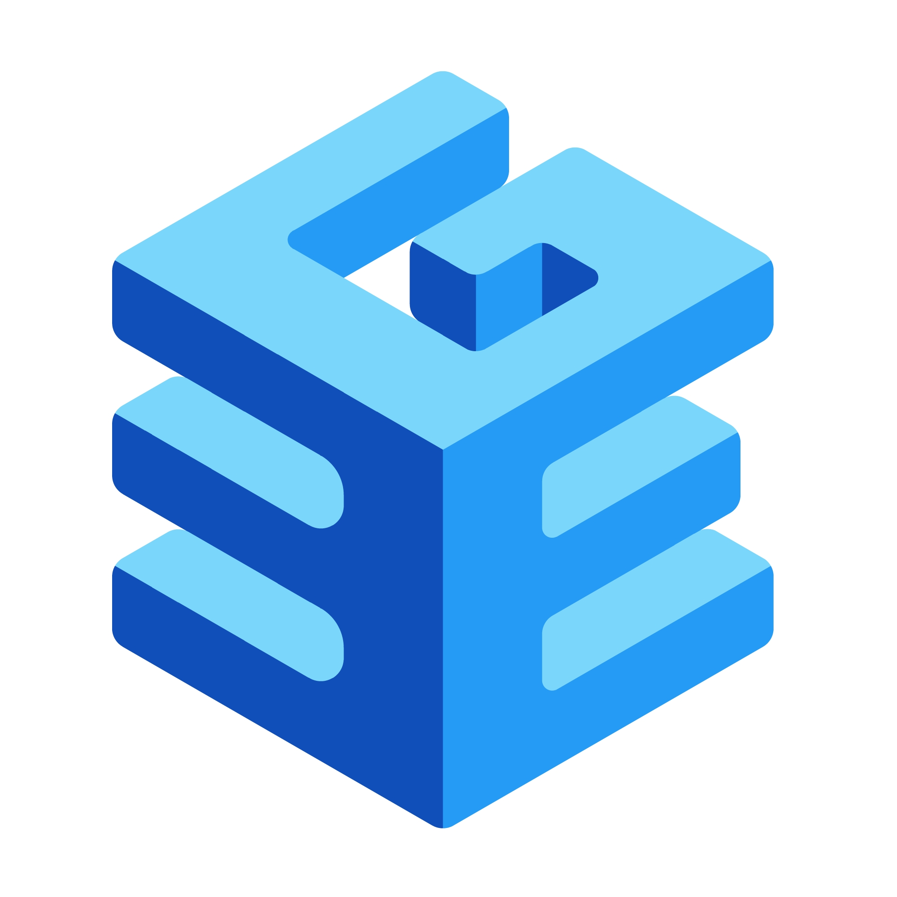

#   Qdrant - bgem3 RAG Chatbot Framework

A retrieval-augmented generation (RAG) chatbot framework built on Qdrant, BGE-M3 embeddings, and Ollama.

This repository provides the core framework; users supply their own text data on AWS S3, and the chatbot automatically handles embeddings, retrieval, reranking, and answer generation.

___________________________________________________________________________________

# Features:
- Dense Retrieval: Uses Qdrant for accurate vector search
- Embeddings: Automatically generates embeddings using BGE-M3.
- Reranking: Reranks top retrieved documents for relevance.
- Context-Aware Answers: Maintains a short conversation history.
- Answer Combining: Merges multiple candidate answers into concise responses.
- Interactive CLI: Ask questions in the terminal.
- Embeddings management (preprocess, store, and backup)

___________________________________________________________________________________


# 🛠 Installation
1.	Clone the repository:
   ```bash
 	git clone <repo_url>
	cd motive-rag-chatbot
   ```

2. Create a virtual environment:
   ```bash
    python -m venv venv
	source venv/bin/activate      # macOS/Linux
	venv\Scripts\activate         # Windows
   ```

3.	Install dependencies:
   ```bash
	pip install --upgrade pip
	pip install -r requirements.txt
   ```

4. Create your .env file:
   ```bash
    cp .env.example .env
   ```
5. Fill in your AWS and service credentials into the .env:
   ```bash
   # AWS S3 credentials
	AWS_ACCESS_KEY_ID=YOUR_AWS_KEY
	AWS_SECRET_ACCESS_KEY=YOUR_AWS_SECRET
	AWS_REGION=YOUR_REGION
	S3_BUCKET_NAME=your-bucket-name
	
	# Qdrant & Ollama settings
	QDRANT_HOST=localhost
	QDRANT_PORT=6333
	COLLECTION_NAME=chatbot_embeddings
	OLLAMA_HOST=http://localhost:11434
	OLLAMA_MODEL=mistral:latest
	BGE_MODEL_NAME=BAAI/bge-m3
	RERANK_MODEL_NAME=BAAI/bge-reranker-base
	USE_FP16=false
   ```
# 🚀 Usage:
1. Run Qdrant (via Docker)
   ```bash
    docker-compose up -d qdrant
   ```

2. Make embeddings from your S3 text data
   ```bash
    python embedding_handler.py
   
3. Run Ollama
   ```bash
    ollama serve
   ```

4. Run the interactive chatbot
   ```bash
    python rag_query_rerank.py
   ```

NOTE: Make sure to check AWS S3 data source directory.

_____________________________________________________________________________

# 🔍 How It Works:

1. **Data Ingestion:**
- Text files are pulled from a user-provided AWS S3 bucket.
- Text is split into smaller chunks (default 180 tokens per chunk with 70 token overlap) to optimize semantic retrieval.
  
2. **Embeddings Generation:**
- Each chunk is converted into a 1024-dimensional dense vector using the BGE-M3 model.
- Embeddings capture semantic meaning, so similar ideas are close in vector space, even if words differ.
  
3. **Vector Storage:**
- Chunks and their embeddings are stored in Qdrant, a fast, scalable vector database.
- Qdrant enables cosine similarity searches to quickly find chunks most relevant to a user query.
  
4. **Query Processing:**
- A user asks a question through the interactive CLI.
- The question is embedded using BGE-M3.
- Top k matching chunks are retrieved from Qdrant based on vector similarity.
  
5. **Reranking:**
- Retrieved chunks are reranked using a cross-encoder model, which evaluates the relevance of each chunk to the query.
- Only the top 3 chunks are kept as context.
  
7. **Answer Generation:**
- A prompt is created for Ollama LLM, including the top context chunks and last few conversation turns.
- The LLM generates a concise (30–40 words), accurate, human-like response.
- If the information is missing or ambiguous, the bot responds honestly: “I don’t have that information.”
  
8. **Conversation Management:**
- Keeps track of the last 5 interactions for context-aware answers.
- History is updated automatically after each response.
  
9. **Optional Backup:**
- Embeddings metadata can be backed up to S3 for recovery or migration.
